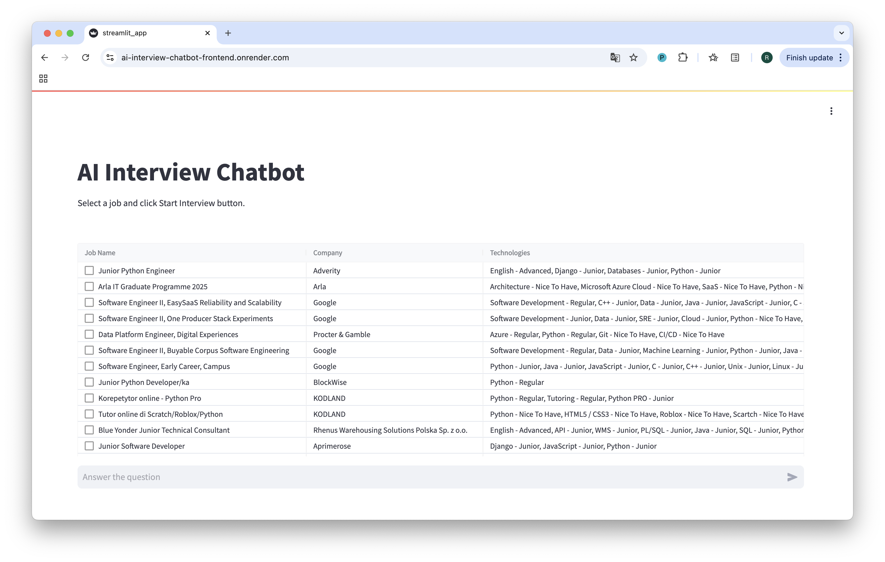
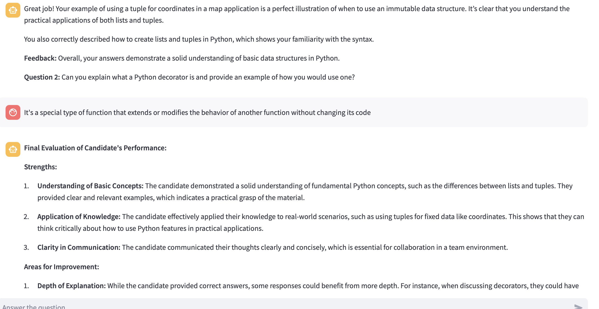
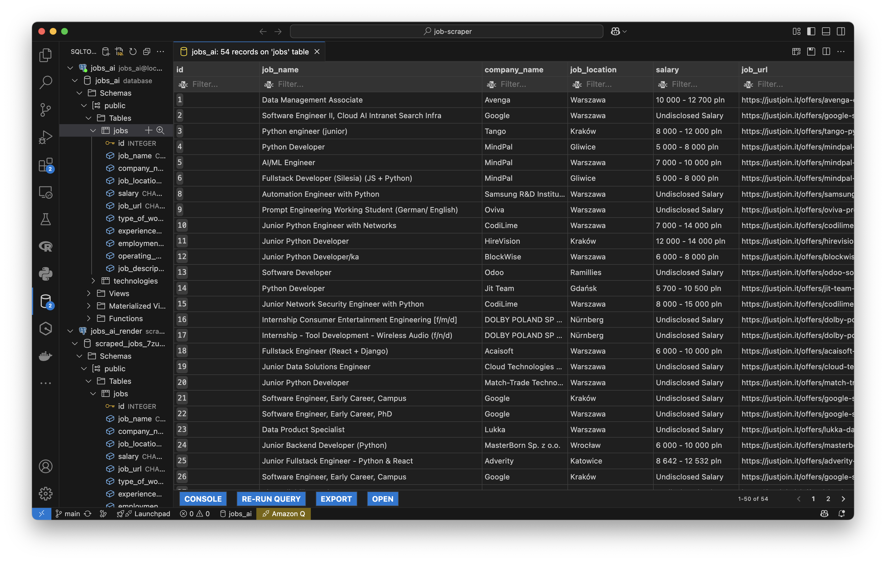
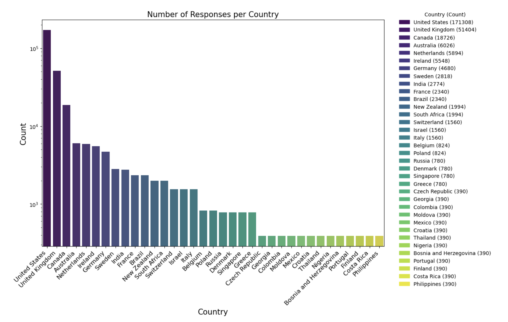
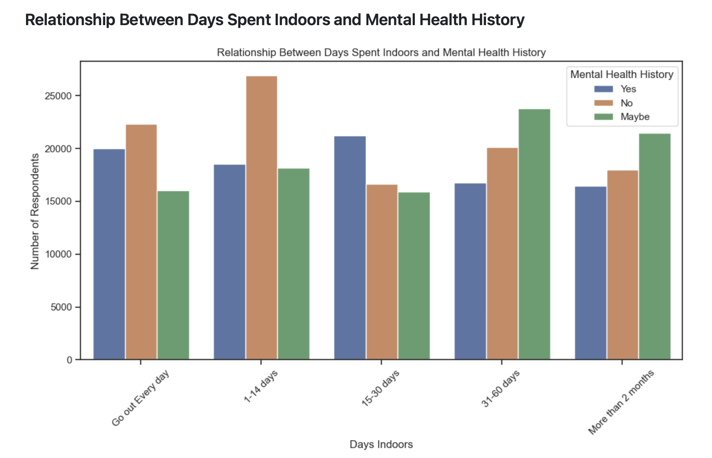
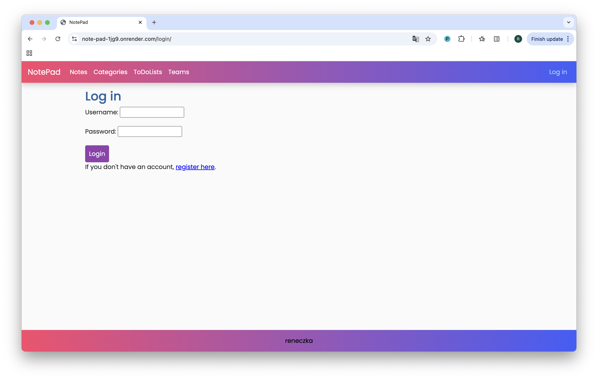
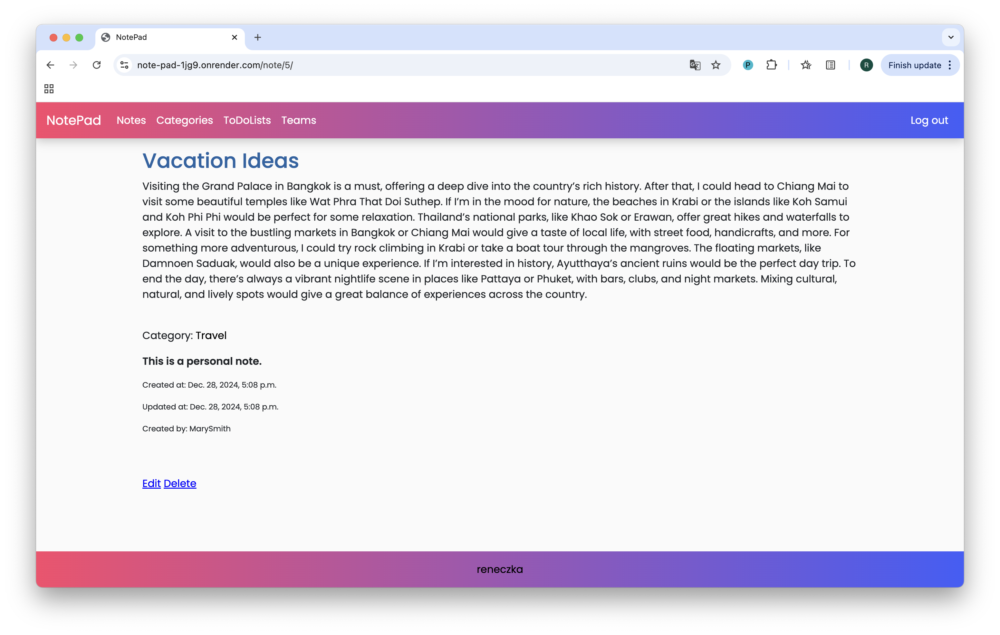
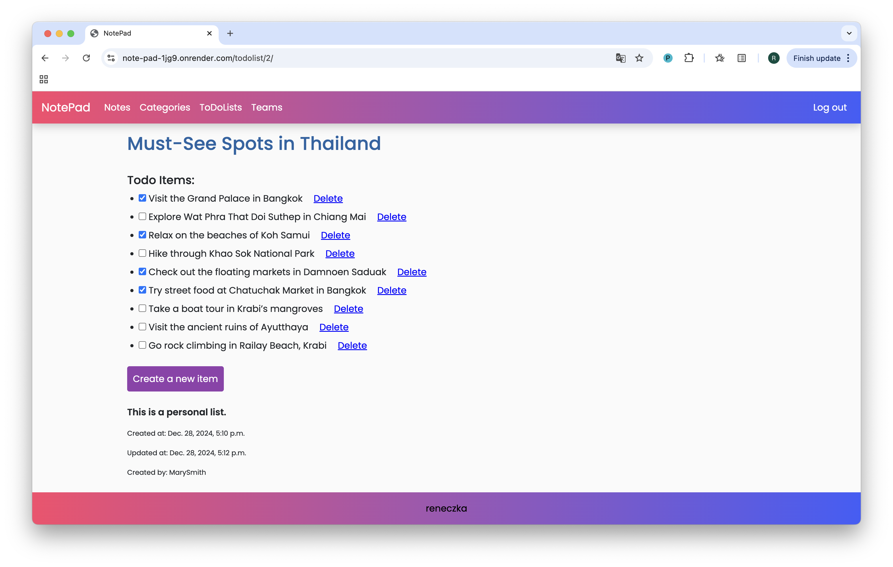
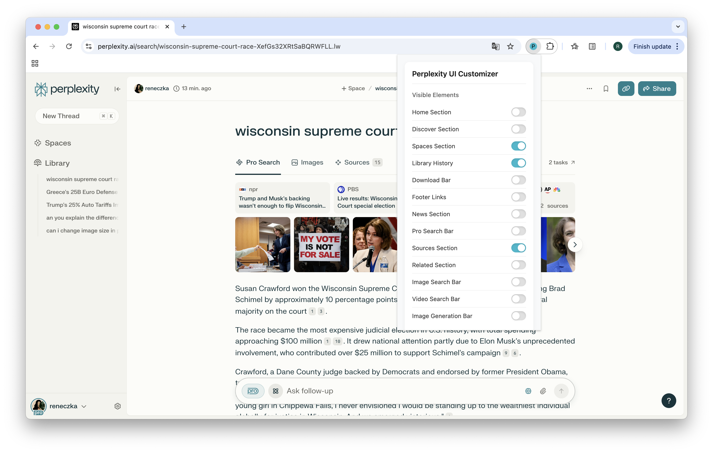

# Portfolio

Welcome to my GitHub portfolio! I'm a **Junior Python Developer** passionate about **web scraping, data visualization, and AI-driven applications**. Below, you'll find an overview of my projects showcasing my skills and learning journey.

## 📌 Featured Projects

### [AI Interview Chatbot](https://github.com/reneczka/ai-interview-chatbot)
🔹 **Live Demo**: [AI Interview Chatbot](https://ai-interview-chatbot-frontend.onrender.com) *(Please allow time for cold start or refresh the page)*

An AI-powered interview chatbot that generates job-specific technical questions, evaluates responses, and provides feedback.

**Tech Stack**: Python, FastAPI, OpenAI API, Streamlit, PostgreSQL, Docker, Render, Git

#### Screenshots

---

### [Job Board Scraper](https://github.com/reneczka/job-scraper)
A web scraper designed to extract detailed job listings, including titles, companies, locations, salaries, and required technologies. Data is stored in a PostgreSQL database for further analysis.

**Tech Stack**: Python, Playwright, SQLAlchemy, PostgreSQL, Git

#### Screenshots

---

### [Mental Health Data Analysis](https://github.com/reneczka/mental-health)
A comprehensive analysis of global mental health trends using Kaggle-sourced data. It explores correlations between demographics, stress, and access to mental health support.

**Tech Stack**: Python, Jupyter Notebook, Pandas, Matplotlib, Seaborn, Git

#### Screenshots

---

### [Notepad App](https://github.com/reneczka/notepad)
🔹 **Live Demo**: [Notepad App](https://note-pad-1jg9.onrender.com) *(Please allow time for cold start)*

An online note-taking and task management app with categories and shared notes for team collaboration.

**Tech Stack**: Python, Django, PostgreSQL, HTML, CSS, Render, Git

#### Screenshots

---

### [Perplexity Customizer Chrome Extension](https://github.com/reneczka/perplexity-simplifier)
🔹 **Live Demo**: [Chrome Web Store](https://chromewebstore.google.com/detail/perplexity-ui-customizer/kieplcfhfeibcidpapmjbmaodacgkh)

A Chrome extension that allows users to customize the Perplexity AI website by modifying its appearance through a user-friendly UI.

**Tech Stack**: JavaScript, Chrome Extension API, HTML, CSS, Git

#### Screenshots

---

### [Clipboard Manager App for macOS](https://github.com/reneczka/ClipboardManager)
A macOS app for managing clipboard history, making it easier to organize and access previously copied content.

**Tech Stack**: Swift, SwiftUI, Core Data, Xcode

#### Screenshots

